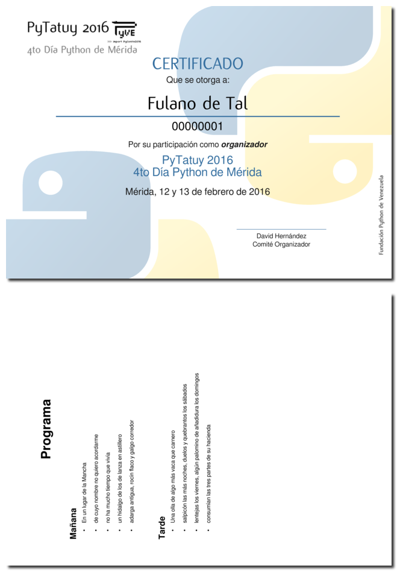

# generador-de-certificados
Generador en masa de certificados en pdf

----

## Requerimientos:
Para el funcionamiento del script debe tener instalado:
* inkscape
* pdfmerge

## Instrucciones
#### Plantilla svg
`certificado.svg` es la plantilla del certificado, ella contiene las siguientes variables que no deben ser modificadas en el svg:

* `Nombre_Participante`
* `cedula`
* `Rol`
* `Evento`
* `subtitulo`
* `Fecha`

<BR>
certificado.svg

#### Lista de participantes
`participantes.csv` es un archivo de texto plano que contiene la tabla de participantes y sus datos. El formato es el siguiente:

```
Fulano de Tal,00000001,correo1@correo.com,1
Zutano de Tal,00000002,correo2@correo.com.ve,0
Mengano de Tal,00000003,correo3@correo.com,2
```
Donde, la primera columna va el(los) nombre(s) y apellido(s), en la segunda la cédula de identidad o carnet de identificación, la tercera columna contiene la dirección de correo electrónico, esto para efectos de tener una dirección a donde enviar el certificado, y en la última columna un valor entero entre 0 y 2.

El valor `0` representa "Ponente", el `1` representa "Organizador" y el `2` significa "Participante".

#### Programa
EL programa es un documento con formato pdf, rotado, de nombre `programa.pdf`, que será añadido como reverso del certificado.

#### Script de generación
`certificado.py` es el programa que se encarga del proceso de generación de certificados. Dentro de este archivo la sección mas importante está en el `main()`, allí se **debe** modificar del diccionario `reemplazos` la información que acompaña `Evento`, `subtitulo` y `Fecha`. La información de `Rol` puede ser modificada a conveniencia. `'Nombre_Participante':nombre, 'cedula':cedula` no deben ser modificados pues estos datos se importan de la lista de participantes `participantes.csv`.

`reemplazos = {'Nombre_Participante':nombre, 'cedula':cedula, 'Rol':'Por su participación como <tspan font-weight = "bold" font-style = "italic">' + rol + '</tspan>', 'Evento':'PyTatuy 2016', 'subtitulo':'4to Día Python de Mérida','Fecha':'Mérida, 12 y 13 de febrero de 2016'}`

El script genera un certificado en formato pdf por cada participante  de la lista, el formato de nombre es `cédula-rol.pdf`

## Ejecución
* En una misma carpeta deben estar los archivos `certificado.svg`,
`participantes.csv`, `programa.pdf` y `certificado.py`, previamente adaptados.
* En la consola, dentro de este directorio, ejecutar: `python certificado.py`
* Se toma aproximadamente 10 segundos por certificado.

#### Salida
Archivo de salida:

<BR>
00000001-organizador.pdf
